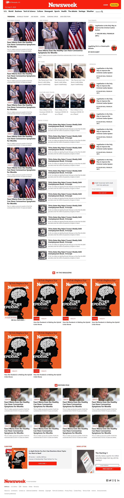

# Microverse project: Using Bootstrap - Replica of the news site Newsweek.com

> This is a Newsweek homepage page clone using HTML and CSS3.

## Screenshots of our clone website

## Screenshot of the original website

The project is built using Html and CSS with an extensive use of the Bootstrap CSS framework, flex and grid positioning.

## Built With

- HTML
- CSS3
- Bootstrap
- Font awesome icons

## Live Demo

[Live Demo Link](https://raw.githack.com/KartheekWD/newsweek-clone/homepage/index.html)

## To get a local copy up and running follow these simple example steps.

### Setup

Clone the project locally.

### Linters

1. run `npm install`.
2. run `npm run test` to check the Html and Css files.

### Deployment

Install and run a live server plugin on you IDE/Text editor and run it from the root directory.

## Authors

👤 **KartheeK Paturu**

- Github: [@KartheekWD](https://github.com/KartheekWD)
- Twitter: [@KartheekWD](https://twitter.com/KartheekWD)
- Linkedin: [Kartheekwd](https://www.linkedin.com/in/ceamatu-cristian-viorel-7a5469136/)

👤 **RICK OBURU**

- Github: [@RICKCOYL](https://github.com/RICKCOYL)
- Twitter: [@rickoburu](https://twitter.com/rickoburu)
- Linkedin: [rick OBURU](https://linkedin.com/in/rick-oburu-8627591a4)

## Show your support

Give a ⭐️ if you like this project!

